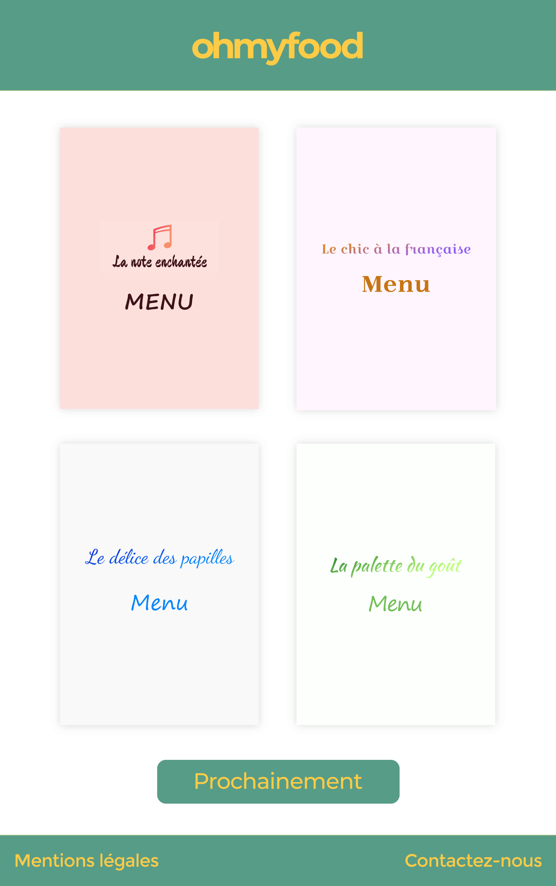

# Ohmyfood!

### Voici Ohmyfood, le 3ème projet de la formation développeur web proposée par Openclassrooms.

## Contexte

Ohmyfood! est une entreprise de réservation de restaurants et de composition de menus  en ligne. Notre concept permet aux utilisateurs de réduire leur temps d’attente dans les  restaurants car leur menu est préparé à l’avance. Plus de perte de temps à consulter la  carte 

Nous souhaitons proposer à nos clients les menus des meilleurs restaurants. Développé à  New-York dans un premier temps, nous souhaitons élargir notre concept à la capitale de la  gastronomie : Paris.

Nous nous positionnons sur un marché de niche, avec les meilleurs restaurants des villes  dans lesquelles nous sommes établis. Nous souhaitons être identifiés comme une  entreprise proposant des services haut de gamme.

## Objectifs

● Phase 1 : Développer un site proposant le menu de 4 grands restaurants parisiens: sous 1 mois

● Phase 2 : Permettre la réservation en ligne et la composition de menus: sous 6 mois

## Spécifications techniques

● Le développement devra se faire en CSS.

● L’ensemble du site devra être responsive. 

● Le page HTML devra passer la validation w3c sans erreur.

● Aucun framework ne devra être utilisé. 

● Le code CSS passe la validation w3c CSS.

● Des règles CSS @media et/ou des feuilles de styles dédiées identifiées par un  attribut media doivent être utilisées. 

● Aucun code CSS ne devra être appliqué via un attribut style dans une balise  HTML. 

● Le site doit être parfaitement compatible avec les dernières versions desktop de  Chrome, Firefox et  Safari.

## Livrables attendus

### Un site web comprenant :

● Une page d’accueil avec le logo de l’entreprise, un espace contenant les 4 menus,  une section “prochainement” et les rubriques « Mention légales » et « Contactez-nous »

● 4 pages contenant chacune le menu d’un restaurant. Au clic sur le menu sur la page  d’accueil, l’utilisateur est redirigé vers la page du menu 

● Au clic sur “Mentions légales”, une nouvelle page s’ouvre 

● Au clic sur “Contactez-nous”, un renvoi vers une adresse mail est effectué

● Le header (contenant le logo de l’entreprise) et le footer (contenant “Mentions  légales” et “Contactez-nous) sont présents sur toutes les pages

● Le footer doit rester visible même si l’on scrolle.

### Des effets graphiques :

● Pour chaque item de type menu, une animation qui fait un zoom sur l'image devra  être intégrée, avec un effet de fondu (réduire l'opacité) sans faire grossir le cadre  initial

● Dans la section prochainement, des points de suspension devront s’animer  progressivement. Ils pourront soit s’agiter comme quand quelqu’un tape un  nouveau message, soit apparaître progressivement 

● Les boutons “contact” et “mentions légales” devront se secouer (effet wiggle) 

● Les titres représentant les catégories entrées, plats, desserts devront être soulignés  de gauche à droit au survol de la souris​.

## Maquettes fournis

## Capture d'ecrans

### Sur Safari :

### Sur Google Chrome :

### Sur Galaxy S5:

### Des iPhone X en mode paysage :

